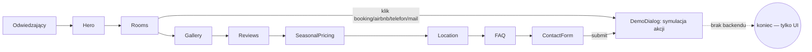

# ARCHITECTURE — mapa dla obcego (1 strona)

<!-- Cel: senior, ktory nigdy nie widzial repo, znajduje miejsce zmiany w 15 min. -->

## Co to jest (3 zdania)
Sprzedażowa strona-wizytówka (jednostronicowa) dla islandzkiego domku/pensjonatu "Fjallsýn" (nazwa z tekstów:
info@fjallsyn.is). Cel: pokazać właścicielowi noclegu, jak wygląda gotowa strona rezerwacyjna — wszystkie akcje
(booking.com, Airbnb, telefon, e-mail, WhatsApp, formularz kontaktowy) są **zasymulowane** przez `DemoDialog`
zamiast realnie wychodzić na zewnątrz. To DEMO/SHOWCASE, nie działający system rezerwacji.

## Stack (z package.json)
- Frontend: React 18 + TypeScript, Vite, react-router-dom (1 realna trasa), TanStack Query (zainicjowany, bez zapytań sieciowych)
- UI: Tailwind CSS + shadcn/ui (Radix), lucide-react ikony
- Backend/DB: **brak** — zero Supabase/API, wszystkie dane (pokoje, ceny, recenzje) hardcoded w komponentach
- i18n: własny `src/i18n/LanguageContext.tsx` (PL/EN/IS), przełącznik w `LanguageSwitcher.tsx`
- Hosting: **Lovable** (obecność `lovable-tagger` w `vite.config.ts`) — zmiany trafiają na produkcję przez
  ręczny **Publish** w Lovable UI, `git push` na `main` samo NIE deployuje

## Moduły i granice (co jest gdzie)
| Katalog | Odpowiedzialność | Tier |
|---|---|---|
| `src/pages/Index.tsx` | jedyna realna strona — składa wszystkie sekcje w kolejności scrolla | T1 |
| `src/components/*.tsx` | sekcje one-page (Hero, Rooms, Gallery, Reviews, SeasonalPricing, Location, FAQ, ContactForm, Footer…) | T1 |
| `src/components/DemoDialog.tsx` | **rdzeń demo-mechaniki** — przechwytuje kliknięcia zewnętrznych akcji (booking.com/Airbnb/telefon/mail/WhatsApp/formularz) i pokazuje modal "to by zrobiło X" zamiast realnej akcji | T1 |
| `src/components/ui/*` | shadcn/ui prymitywy (generowane, nie edytować ręcznie bez potrzeby) | T0 |
| `src/i18n/LanguageContext.tsx` | słownik + kontekst języka PL/EN/IS | T1 |
| `src/assets/*` | statyczne zdjęcia (pokoje, galeria, host) | T0 |

## Przepływ użytkownika

## Gdzie jest…
- ceny pokoi: hardcoded w `src/components/ContactForm.tsx` i `src/components/Rooms.tsx` (array `rooms`)
- teksty PL/IS/EN: `src/i18n/LanguageContext.tsx`
- "wysyłka" formularza / redirecty zewnętrzne: nigdzie naprawdę — patrz `DemoDialog.tsx`
- sekrety: brak (brak integracji zewnętrznych)

## Decyzje nieodwracalne
`docs/adr/` — zobacz istniejące ADR w repo.

## Jak to cofnąć / kill switch
Strona statyczna bez backendu — rollback = Lovable "Revert to this version" albo `git revert` + Publish.
